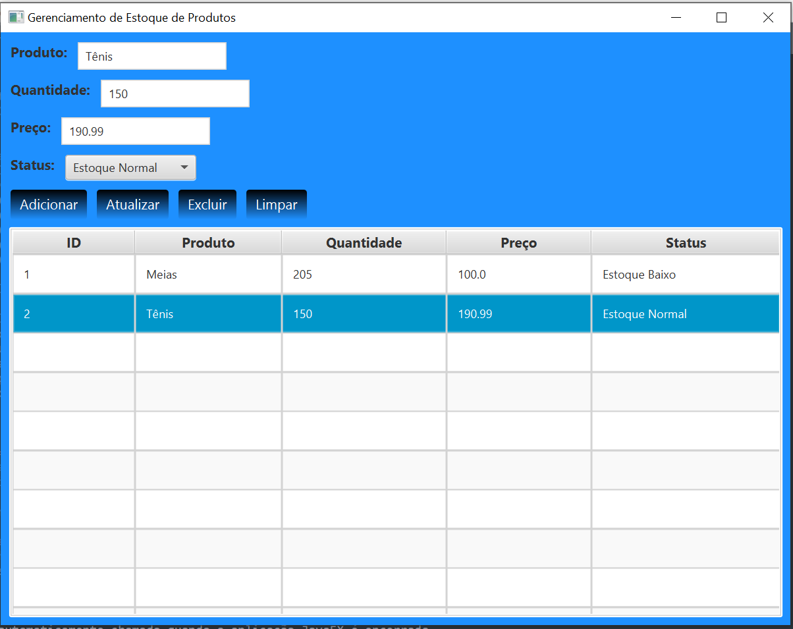

# Gerenciador de Produtos com JDBC e JavaFX

Este é um projeto de **Gerenciador de Produtos** desenvolvido em **Java 22**, com persistência de dados via **JDBC** e **SQLite**, e interface gráfica construída com **JavaFX**.



---

## 📚 Formação

Este projeto foi desenvolvido como parte da formação **"Java Moderno - Do Básico ao Avançado com Projetos"**, ministrado pelo **Eng. Arnaldo Alves** na plataforma **Udemy**.

🔗 [Java Moderno, Fácil de Seguir, com Spring Boot e 11 Projetos (Udemy)](https://www.udemy.com/course/curso-de-java-para-iniciantes-com-projetos/)

---

## 🧰 Tecnologias Utilizadas

- ✅ Java 22  
- ✅ JDBC  
- ✅ SQLite  
- ✅ JavaFX  

---

## ⚙️ Setup do Ambiente

Antes de executar o projeto, é necessário configurar as seguintes variáveis de ambiente no seu sistema:

### 🔧 Variáveis de Ambiente

- `%JAVA_HOME%` → Caminho da instalação do **JDK 22**
- `%PATH_TO_FX%` → Caminho da pasta `lib` do **JavaFX SDK**  
  (Exemplo: `C:\javafx-sdk-21\lib`)

### ▶️ Executando o Programa

No terminal, execute o seguinte comando no diretório do projeto:

```bash
java --module-path %PATH_TO_FX% --add-modules javafx.controls ProdutoGUI
